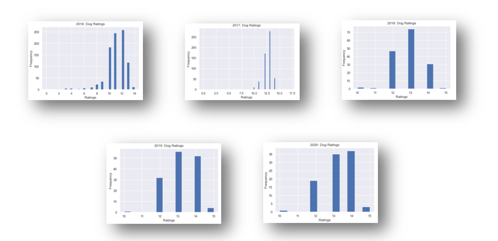
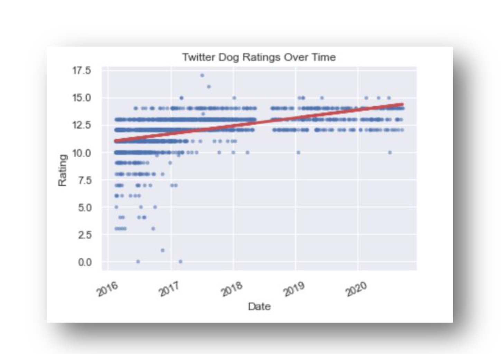

# Pup Inflation: Stop the Count, We Are Already Over 10!
### An Average Blog by Kaveh Alemi

Today we will explore how dog ratings on the very famous Twitter page, @dog_rates, has changed over the past four years. If you aren’t familiar with @dog_rates it’s a Twitter page where dog owners post a tweet about their dogs which includes a picture of their dog, a comment about how cute their canine is, accompanied with a rating of their pet scored out of 10. We have gotten hold of a sample of tweets made on the page from 2016 up until now, and plan on analyzing the tweets for any interesting insights. The first thing we did was to extract the ratings from each tweet by using some fairly simple regular expression algorithms. Once we did this, we created some cool visualizations to see the distribution of all of the dog ratings.

This is a pretty interesting plot. The concentration of data points, being either the mean or median, appears to be around 12.5. Did we already mention that these ratings are supposed to be out of 10; it’s very clear that some people are cheating, 1577 to be exact! Let’s explore the distribution of dog ratings grouped by year.

From these plots, we can see that people were much more honest in 2016; ouch, someone rated their dog a 3 out 10. We can see that starting from 2017, the distribution of ratings began to drastically shift right with no ratings dipping below 10. It appears that ratings are steadily increasing over time. People are either (1) getting more dishonest, or (2) dogs are way getting cuter. Let’s put all of this data together into scatterplot and fit a line of best fit.

Once again, we see that ratings below 10 are a lot more apparent in 2016 in comparison to all other years. Also, the Line of Best Fit obtained from doing basic Linear Regression, shows us that the dog ratings are in fact increasing over time. So why is this happening? Are humans getting more dishonest on the internet? Are dogs really getting exponentially cuter causing our standard metrics of cuteness to no longer hold? As far as I can tell, no will ever know… Here is a fun fact though, as a result of doing some simple Natural Language Processing, I compiled a list of the most common dog names found in the tweets:

1)	Cooper, 14 appearances
2)	Charlie, 13 appearances
3)	Oliver, 12 appearances
4)	George, 11 appearances
5)	Lucy,	10 appearances
